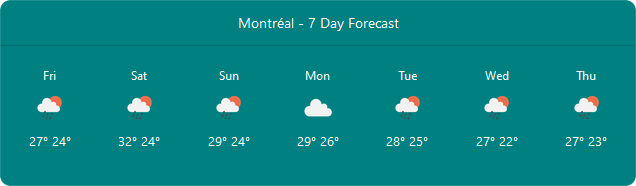

**openwid** (OpenWeather in Dash) is a Python package for creating daily weather forecast components in Plotly Dash framework. You can easily add a fully responsive weather forecast card to your Dash applications. Before starting, you need to get a unique API key from <a href="https://home.openweathermap.org/api_keys">OpenWeather</a> website.

## Install
openwid can be installed using
```
pip install openwid
```

## Getting Started

Here is a very simple example that creates 7 day weather forecast card for Montréal:
```
import dash
import dash_bootstrap_components as dbc
import dash_html_components as html

from openwid import Openwid   # Importing openwid

openwid_mon = Openwid(
    api_key="YOUR_API_KEY",   # <-- Edit Here
    latitude="45.501690",
    longitude="-73.567253"
)

app = dash.Dash(
    __name__, meta_tags=[{"name": "viewport", "content": "width=device-width"}],
    external_stylesheets = [dbc.themes.PULSE]
)

app.layout = html.Div(
    [
        html.Div(
            [
                dbc.Row(
                    dbc.Col(
                        openwid_mon.get_card(city_name="Montréal", days=7),
                        lg=6,
                        md=6,
                        sm=12
                    ),
                )
            ], style={"margin": "2rem"}
        )
    ]
)

if __name__ == '__main__':
    app.run_server(debug=True)
```

## Constructor / reinitialise

### OPENWID()
You can use Openwid class as an instance.
```
Openwid(
    api_key="YOU_API_KEY",
    latitude="LATITUDE",
    longitude="LONGITUDE"
)
```
The ```Openwid()```constructor takes the following arguments:

**api_key**  
&emsp;the unique OpenWeather API key  
**latitude**  
 &emsp;latitude of the location  
**longitude**  
&emsp;longitude of the location  
    
### Component Functions
You can use this function to add a card component to your layout.

### GET_CARD()
```
get_card(
    city_name="CITY_NAME",
    days=4,
    bg_color="#00202f"
)
```

The ```get_card```function takes the following arguments:

**city_name**  
&emsp;the city name in card header  
**days**  
&emsp;how many days weather forecast will be shown, default=4  
**bg_color**  
&emsp;background color of the weather card, default=#00202f  

## Screenshots

